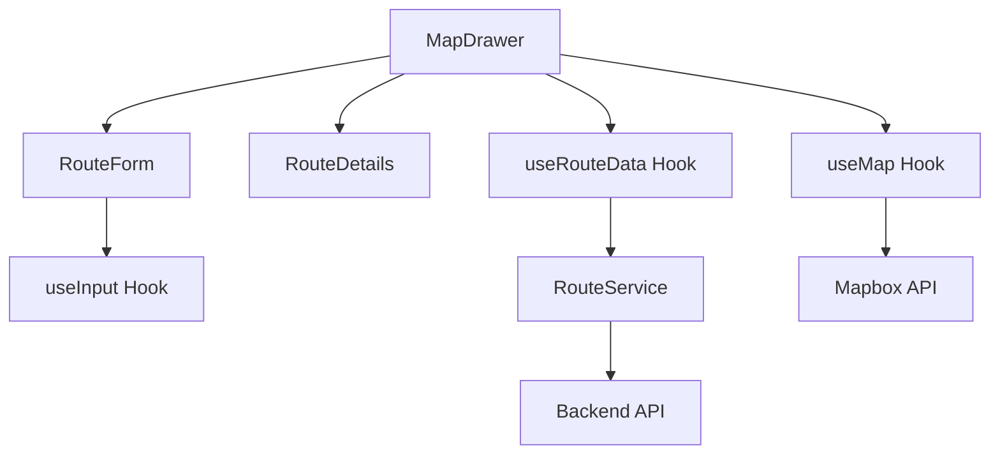

<div align="center">

# 🚗 Air Pollution Routing

[](https://reactjs.org/)
[](https://www.mapbox.com/)
[](https://daisyui.com/)
[](LICENSE)
[](https://github.com/your-repo)

> **Smart route planning that prioritizes environmental impact alongside traditional factors**

</div>

---

## ✨ Overview

Air Pollution Routing is a cutting-edge web application that revolutionizes route planning by considering environmental factors. Unlike traditional navigation apps that focus solely on distance and time, our platform optimizes routes based on **air pollution exposure**, **carbon emissions**, and **energy efficiency**.

### 🌟 Key Highlights

- 🎯 **Multi-Objective Optimization**: Balance distance, time, pollution, and emissions
- 🚗 **Vehicle-Specific Routing**: Tailored routes for cars and two-wheelers
- 📊 **Real-time Analytics**: Comprehensive environmental impact metrics
- 🗺️ **Interactive Maps**: Beautiful Mapbox-powered visualizations
- ⚡ **Modern Architecture**: Built with React hooks and modular design

---

## 🚀 Quick Start

### Prerequisites

- **Node.js** (v20 or higher)
- **yarn** package manager
- **Mapbox API Key**

### Installation

```bash
# Clone the repository
git clone https://github.com/your-username/air-pollution-routing.git
cd air-pollution-routing

# Install dependencies
yarn install

# Set up environment variables
cp .env.example .env
# Edit .env with your API keys

# Start development server
yarn start
```

🎉 **That's it!** Open [http://localhost:3000](http://localhost:3000) to see the app in action.

---

## 🎯 Features

### 🚗 Intelligent Vehicle Support

| Feature | Car | Two Wheeler |
|---------|-----|-------------|
| **Mass Range** | 800-3000 kg | 100-300 kg |
| **Engine Types** | Petrol, Diesel, CNG, EV | Petrol, Diesel, CNG, EV |
| **Condition** | Age-based optimization | Age-based optimization |

### 🛣️ Advanced Route Types

<div align="center">

| Route Type | 🎯 Objective | 🎨 Color | 💡 Best For |
|------------|--------------|----------|-------------|
| **Shortest** | Minimize distance | 🔵 Blue | Fuel efficiency |
| **Fastest** | Minimize time | 🟢 Green | Time-sensitive trips |
| **LEAP** | Minimize pollution exposure | 🟠 Orange | Health-conscious users |
| **LCO2** | Minimize carbon emissions | 🔴 Red | Environmental impact |
| **Suggested** | Balanced optimization | 🟣 Purple | **Recommended** |

</div>

### 📊 Comprehensive Analytics

- **Distance**: Human-readable measurements (km, miles)
- **Time**: Accurate travel estimates with traffic
- **Pollution Exposure**: Air quality impact (μg/㎥)
- **Energy Consumption**: Route efficiency (kJ)
- **Step-by-step Navigation**: Detailed turn-by-turn instructions

---

## 🏗️ Architecture

Our application follows modern React best practices with a clean, modular architecture:



### 📁 Project Structure

```
src/
├── 📦 components/          # React components
│   ├── 🎯 MapDrawer.js    # Main application container
│   ├── 📝 RouteForm.js    # User input form
│   ├── 📊 RouteDetails.js # Route information display
│   ├── 🧭 Instruction.js  # Navigation instructions
│   └── 🎛️ useInput.js     # Custom input hook
├── 🪝 hooks/              # Custom React hooks
│   ├── 🗺️ useMap.js       # Map functionality
│   └── 📈 useRouteData.js # Route data management
├── 🔧 services/           # API and business logic
│   └── 🛣️ routeService.js # Route calculation service
├── ⚙️ constants/          # Configuration and constants
│   └── 📋 index.js        # Centralized constants
└── 🛠️ utils/              # Utility functions
    ├── 📍 getGeojson.js   # GeoJSON conversion
    ├── 🚗 getIconFromMode.js # Vehicle icons
    ├── ⚖️ getMassfromMode.js # Vehicle mass calculations
    └── 🎨 getRouteColor.js # Route color mapping
```

---

## 📖 Usage Guide

### 1. 🚗 Vehicle Configuration
1. Select your vehicle type (Car or Two Wheeler)
2. Enter vehicle mass within the specified range
3. Choose vehicle condition based on age
4. Select engine type (Petrol, Diesel, CNG, or EV)

### 2. 🛣️ Route Selection
- **Shortest**: For fuel efficiency
- **Fastest**: For time-sensitive trips
- **LEAP**: For health-conscious routing
- **LCO2**: For environmental impact
- **Suggested**: **Recommended** balanced approach
- **All**: Compare all route types

### 3. 📍 Location Input
- Type source and destination addresses
- Use autocomplete for accuracy
- Click on map for precise locations

### 4. 📊 Route Analysis
- View comprehensive route summary
- Expand details for in-depth analysis
- Review step-by-step instructions
- Compare multiple routes

---

## 🔧 Configuration

### Environment Variables

```env
# Required
REACT_APP_MAPBOX_API_KEY=your_mapbox_api_key
REACT_APP_SERVER_URL=http://localhost:8000/

# Optional
REACT_APP_GRAPHHOPPER_API_KEY=your_graphhopper_key
```

### Vehicle Specifications

| Vehicle Type | Mass Range | Default Mass | Mode Value |
|--------------|------------|--------------|------------|
| **Car** | 800-3000 kg | 2500 kg | `driving-traffic` |
| **Two Wheeler** | 100-300 kg | 150 kg | `scooter` |

---

## 🛠️ Development

### Getting Started

```bash
# Install dependencies
yarn install

# Start development server
yarn start

# Run tests
yarn test

# Build for production
yarn build
```

### Code Quality

Our codebase follows modern React best practices:

- ✅ **Functional Components** with hooks
- ✅ **Custom Hooks** for reusable logic
- ✅ **Service Layer** for business logic
- ✅ **Constants** for configuration
- ✅ **Type Safety** with consistent naming

### Testing

```bash
# Run all tests
yarn test

# Run with coverage
yarn test --coverage

# Run in watch mode
yarn test --watch
```

---

## 🌐 API Integration

### Endpoints

| Method | Endpoint | Description |
|--------|----------|-------------|
| `POST` | `/all-routes` | Get all route types |
| `POST` | `/route` | Get single route |

### Request Format

```json
{
  "source": [longitude, latitude],
  "destination": [longitude, latitude],
  "delayCode": 0,
  "mode": "driving-traffic",
  "route_preference": "balanced",
  "vehicle_mass": 2500,
  "condition": "good",
  "engine_type": "petrol"
}
```

### Response Format

```json
{
  "distance": 15000,
  "time": 1800000,
  "total_exposure": 45.2,
  "total_energy": 1250.5,
  "instructions": [...]
}
```

---

## 🚀 Deployment

### Production Build

```bash
yarn build
```

### Deployment Options

- **Netlify**: Drag and drop `build` folder
- **Vercel**: Connect GitHub repository
- **AWS S3**: Upload static files
- **GitHub Pages**: Use GitHub Actions

### Environment Setup

Ensure all required environment variables are configured in your hosting platform.

---

## 🤝 Contributing

We welcome contributions! Here's how you can help:

### 🐛 Bug Reports

1. Check existing issues
2. Create a new issue with detailed description
3. Include steps to reproduce

### 💡 Feature Requests

1. Describe the feature
2. Explain the use case
3. Discuss implementation approach

### 🔧 Code Contributions

1. Fork the repository
2. Create a feature branch
3. Make your changes
4. Add tests if applicable
5. Submit a pull request

### Development Guidelines

- Follow existing code structure
- Add appropriate documentation
- Ensure all tests pass
- Update constants for new features
- Maintain separation of concerns

---

## 📄 License

This project is licensed under the MIT License - see the [LICENSE](LICENSE) file for details.

---

## 🙏 Acknowledgments

- **Mapbox** for mapping and geolocation services
- **React Community** for the amazing framework
- **DaisyUI** for beautiful UI components
- **All contributors** who made this project possible

---

<div align="center">

**Built with ❤️ by the Air Pollution Routing Team**

[⬆ Back to top](#-air-pollution-routing)

</div>


